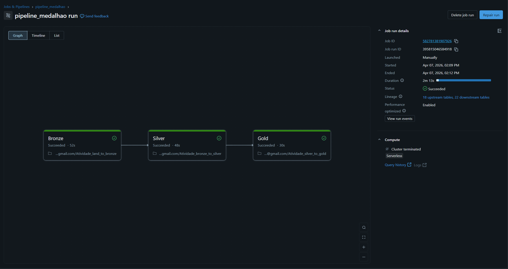
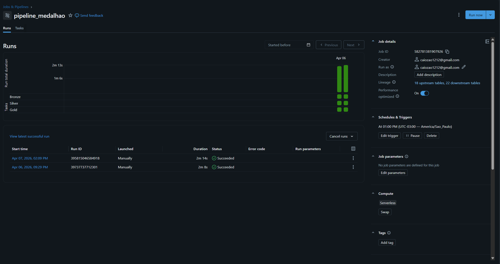

# Projeto Medalhão - Engenharia de Dados

## Descrição
Pipeline de dados baseado na arquitetura Medalhão (Bronze, Silver e Gold),
utilizando Databricks.

## ⚙️ Estrutura
- Atividade_land_to_bronze: ingestão de dados brutos
- Atividade_bronze_to_silver: limpeza e padronização
- Atividade_silver_to_gold: agregações e métricas de negócio

## 🚀 Orquestração
Job automatizado no Databricks com execução diária às 13:00.

## 📂 Evidências

### Execução do Job - Parte 1

### Execução do Job - Parte 2

## 🛠 Tecnologias
- Apache Spark
- Delta Lake
- Databricks
- Python

## Aluno
- Caio Ferreira Lira de Oliveira
